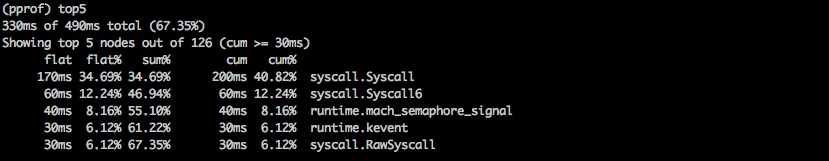
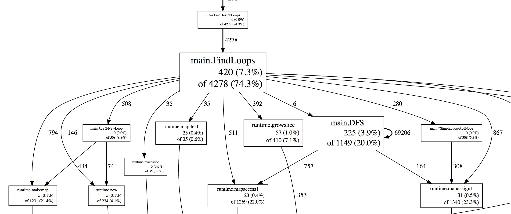
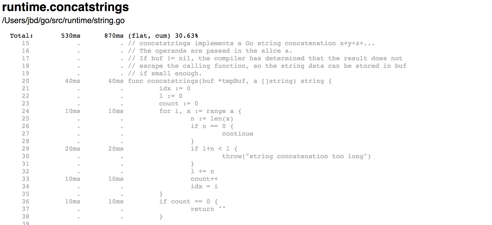
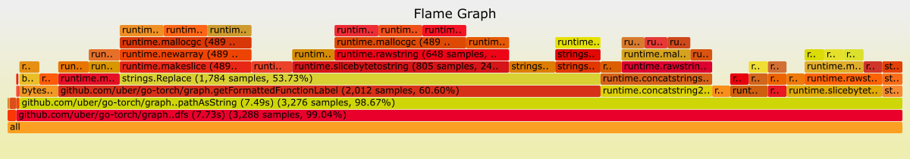
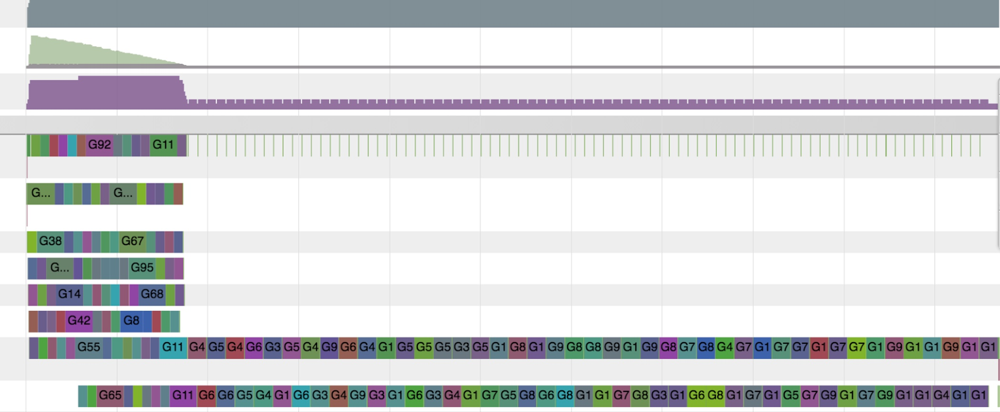

# [诊断](https://go.dev/doc/diagnostics)

## 介绍

Go生态系统提供了大量的API和工具来诊断Go程序中的逻辑和性能问题。本页总结了可用的工具，并帮助 Go 用户为他们的特定问题选择合适的工具。

诊断解决方案可分为以下几类：

- `性能分析`：性能分析工具分析 Go 程序的复杂性和开销，例如内存使用情况和常用函数，以识别 Go 程序中开销较大的部分。
- `跟踪`：跟踪是一种对代码进行插桩的方法，用于分析调用或用户请求整个生命周期中的延迟。跟踪结果可以概览每个组件对系统整体延迟的贡献。跟踪可以跨越多个 Go 进程。
- `调试`：调试允许我们暂停 Go 程序并检查其执行情况。通过调试可以验证程序状态和流程。
- `运行时统计信息和事件`：收集和分析运行时统计信息和事件可以提供 Go 程序健康状况的高级概览。指标的峰值/谷值有助于我们识别吞吐量、利用率和性能的变化。

注意：某些诊断工具可能会相互干扰。例如，精确的内存性能分析会影响 CPU 性能分析，而 goroutine 阻塞性能分析会影响调度器跟踪。为了获得更精确的信息，请单独使用各个工具。

## 性能分析

性能分析有助于识别代码中开销较大或调用频繁的部分。Go 运行时提供 [pprof 可视化工具](https://github.com/google/pprof/blob/master/doc/README.md)所需的格式的性能[分析数据](https://go.dev/pkg/runtime/pprof/)。用户可以通过 `go test` 或 [net/http/pprof](https://go.dev/pkg/net/http/pprof/) 包提供的端点在测试期间收集性能分析数据。用户需要收集性能分析数据，并使用 pprof 工具来筛选和可视化开销较大的代码路径。

[runtime/pprof](https://go.dev/pkg/runtime/pprof) 包提供的预定义性能分析类型：

- `cpu`：CPU 性能分析确定程序在主动消耗 CPU 周期（而非睡眠或等待 I/O）时所花费的时间。
- `heap`：堆性能分析报告内存分配样本；用于监控当前和历史内存使用情况，以及检查内存泄漏。
- `threadcreate`：线程创建性能分析报告导致创建新操作系统线程的程序部分。
- `goroutine`：goroutine 性能分析报告所有当前 goroutine 的堆栈跟踪。
- `block`：阻塞性能分析显示 goroutine 在等待同步原语（包括定时器通道）时阻塞的位置。默认情况下未启用阻塞分析；请使用 `runtime.SetBlockProfileRate` 启用它。
- `mutex`：互斥锁分析报告锁争用情况。当您认为由于互斥锁争用导致 CPU 利用率不足时，请使用此分析。默认情况下未启用互斥锁分析，请参阅 `runtime.SetMutexProfileFraction` 启用它。

### 我还可以使用哪些分析器来分析 Go 程序？

在 Linux 系统上，可以使用 [perf 工具](https://perf.wiki.kernel.org/index.php/Tutorial)来分析 Go 程序。perf 可以分析和展开 cgo/SWIG 代码和内核，因此有助于深入了解原生/内核性能瓶颈。在 macOS 系统上，可以使用 [Instruments](https://developer.apple.com/library/content/documentation/DeveloperTools/Conceptual/InstrumentsUserGuide/) 套件来分析 Go 程序。

### 我可以分析我的生产服务吗？

可以。在生产环境中分析程序是安全的，但启用某些分析器（例如 CPU 分析器）会增加开销。您应该会看到性能下降。可以通过在生产环境中启用分析器之前测量其开销来估算性能损失。

您可能需要定期分析您的生产服务。尤其是在存在多个同一进程副本的系统中，定期随机选择一个副本进行分析是一个稳妥的选择。选择一个生产进程，每隔 Y 秒对其运行 X 秒，并保存结果以供可视化和分析；然后定期重复此过程。可以手动和/或自动审查结果以查找问题。由于采集的分析结果之间可能相互干扰，因此建议每次只采集一个分析结果。

### 如何以最佳方式可视化性能分析数据？

Go 工具使用[`go tool pprof`](https://github.com/google/pprof/blob/master/doc/README.md)提供文本、图表和 [callgrind](http://valgrind.org/docs/manual/cl-manual.html) 可视化性能分析数据。阅读[Profiling Go programs](https://go.dev/blog/profiling-go-programs)一文，即可了解其实际应用。



<small>用文本列出最耗时的调用。</small>



<small>将最耗时的调用以图表形式可视化。</small>

Weblist 视图在 HTML 页面中逐行显示源代码中耗时最长的部分。在以下示例中，`runtime.concatstrings` 函数耗时 530 毫秒，列表中显示了每一行的开销。



<small>将最耗时的调用可视化为 Web 列表。</small>

另一种可视化配置文件数据的方法是[火焰图](http://www.brendangregg.com/flamegraphs.html)。火焰图允许您沿着特定的祖先路径移动，因此您可以放大/缩小特定代码段。[upstream pprof](https://github.com/google/pprof)库支持火焰图。



<small>火焰图提供可视化功能，帮助您发现最耗时的代码路径。</small>

### 我是否只能使用内置的分析器？

除了运行时提供的分析器之外，Go 用户还可以通过 [`pprof.Profile`](https://go.dev/pkg/runtime/pprof/#Profile) 创建自定义分析器，并使用现有工具进行分析。

### 我能否在不同的路径和端口上运行分析器处理程序（`/debug/pprof/...`）？

可以。`net/http/pprof` 包默认将其处理程序注册到默认的复用器，但您也可以使用该包导出的处理程序自行注册。

例如，以下示例将在 `/custom_debug_path/profile` 的 7777 端口上运行 `pprof.Profile` 处理程序：

```go
package main

import (
    "log"
    "net/http"
    "net/http/pprof"
)

func main() {
    mux := http.NewServeMux()
    mux.HandleFunc("/custom_debug_path/profile", pprof.Profile)
    log.Fatal(http.ListenAndServe(":7777", mux))
}

```

## 追踪

追踪是一种对代码进行插桩，以分析整个调用链生命周期中的延迟的方法。Go 为每个 Go 节点提供了一个 [golang.org/x/net/trace](https://godoc.org/golang.org/x/net/trace) 包作为最小追踪后端，并提供了一个带有简单仪表盘的最小插桩库。Go 还提供了一个执行追踪器，用于追踪特定时间间隔内的运行时事件。

追踪使我们能够：

- 对 Go 进程中的应用程序延迟进行插桩和分析。
- 测量长调用链中特定调用的成本。
- 确定资源利用率和性能改进情况。如果没有追踪数据，瓶颈并不总是显而易见的。

在单体系统中，从程序的构建模块收集诊断数据相对容易。所有模块都运行在同一个进程中，并共享公共资源来报告日志、错误和其他诊断信息。一旦系统扩展到单个进程之外并开始分布式，追踪从前端 Web 服务器到所有后端直至用户收到响应的整个调用过程就变得困难起来。分布式追踪正是在这种环境下发挥着重要作用，它可以用于检测和分析生产系统。

分布式追踪是一种对代码进行检测的方法，用于分析用户请求生命周期中的延迟。当系统是分布式的，且传统的性能分析和调试工具无法扩展时，您可能需要使用分布式追踪工具来分析用户请求和 RPC 的性能。

分布式追踪使我们能够：

- 检测和分析大型系统中的应用程序延迟。
- 跟踪用户请求生命周期中的所有 RPC，并发现仅在生产环境中可见的集成问题。
- 找出可以应用于系统的性能改进方案。许多瓶颈在收集追踪数据之前并不明显。

Go 生态系统为各种追踪系统提供了不同的分布式追踪库，包括与后端无关的库。

### 是否有办法自动拦截每个函数调用并创建追踪信息？

Go 语言没有提供自动拦截每个函数调用并创建追踪跨度的方法。您需要手动对代码进行插桩，以创建、结束和注释跨度。

### 如何在 Go 库中传播跟踪头？

您可以在 [`context.Context`](https://go.dev/pkg/context#Context) 中传播跟踪标识符和标签。目前业界还没有规范的跟踪键或通用的跟踪头表示形式。每个跟踪提供程序都负责在其 Go 库中提供传播工具。

### 标准库或运行时中的哪些其他底层事件可以包含在跟踪中？

标准库和运行时正在尝试公开一些额外的 API 来通知底层内部事件。例如，[`httptrace.ClientTrace`](https://go.dev/pkg/net/http/httptrace#ClientTrace) 提供了用于跟踪传出请求生命周期中底层事件的 API。目前正在努力从运行时执行跟踪器中检索底层运行时事件，并允许用户定义和记录他们的用户事件。

## 调试

调试是识别程序行为异常原因的过程。调试器可以帮助我们了解程序的执行流程和当前状态。调试方法有很多种；本节仅重点介绍如何将调试器附加到程序以及如何进行核心转储调试。

Go 用户主要使用以下调试器：

- [Delve](https://github.com/derekparker/delve)：Delve 是 Go 编程语言的调试器。它支持 Go 的运行时概念和内置类型。Delve 致力于成为一款功能齐全、可靠的 Go 程序调试器。
- [GDB](https://go.dev/doc/gdb)：Go 通过标准 Go 编译器和 Gccgo 提供 GDB 支持。Go 的栈管理、线程和运行时机制与 GDB 预期的执行模型存在显著差异，即使程序使用 gccgo 编译，这些差异也可能导致调试器出现问题。尽管 GDB 可以用于调试 Go 程序，但它并非理想之选，并且可能会造成混淆。

### 调试器与 Go 程序的兼容性如何？

`gc` 编译器会执行函数内联和变量注册等优化。这些优化有时会使调试器更难进行调试。目前正在努力改进为优化后的二进制文件生成的 DWARF 信息的质量。在这些改进可用之前，我们建议在构建待调试代码时禁用优化。以下命令构建一个不启用任何编译器优化的包：

```sh
$ go build -gcflags=all="-N -l"
```

作为改进工作的一部分，Go 1.10 引入了一个新的编译器标志 `-dwarflocationlists`。该标志会使编译器添加位置列表，以帮助调试器处理优化后的二进制文件。以下命令构建一个启用了优化但包含 DWARF 位置列表的包：

```sh
$ go build -gcflags="-dwarflocationlists=true"
```

### 推荐使用哪种调试器用户界面？

尽管 delve 和 gdb 都提供了命令行界面 (CLI)，但大多数编辑器集成和 IDE 都提供了专门用于调试的用户界面。

### 是否可以对 Go 程序进行事后调试？

核心转储文件是一个包含正在运行的进程的内存转储及其进程状态的文件。它主要用于程序的死后调试以及了解其运行状态。这两种情况使得核心转储调试成为死后分析生产服务的有效诊断工具。可以从 Go 程序中获取核心转储文件，并使用 delve 或 gdb 进行调试，有关分步指南，请参阅[核心转储调试](https://go.dev/wiki/CoreDumpDebugging)页面。

## 运行时统计信息和事件

运行时提供内部事件的统计信息和报告，供用户在运行时级别诊断性能和资源利用率问题。

用户可以监控这些统计信息，以便更好地了解 Go 程序的整体运行状况和性能。一些常用的监控统计信息和状态如下：

- [`runtime.ReadMemStats`](https://go.dev/pkg/runtime/#ReadMemStats) 报告与堆分配和垃圾回收相关的指标。内存统计信息有助于监控进程消耗的内存资源量、进程是否能够有效利用内存以及捕获内存泄漏。
- [`debug.ReadGCStats`](https://go.dev/pkg/runtime/debug/#ReadGCStats) 读取垃圾回收的统计信息。它有助于了解有多少资源消耗在 GC 暂停上。它还会报告垃圾回收器暂停的时间线和暂停时间百分比。
- [`debug.Stack`](https://go.dev/pkg/runtime/debug/#Stack) 返回当前堆栈跟踪。堆栈跟踪有助于了解当前有多少 goroutine 正在运行、它们正在执行什么操作以及它们是否被阻塞。
- [`debug.WriteHeapDump`](https://go.dev/pkg/runtime/debug/#WriteHeapDump) 暂停所有 goroutine 的执行，并允许您将堆转储到文件中。堆转储是 Go 进程在特定时间点的内存快照。它包含所有已分配的对象，以及 goroutine、终结器等等。
- [`runtime.NumGoroutine`](https://go.dev/pkg/runtime#NumGoroutine) 返回当前 goroutine 的数量。可以监控此值，以查看是否充分利用了 goroutine，或检测 goroutine 泄漏。

### 执行跟踪器

Go 自带运行时执行跟踪器，用于捕获各种运行时事件。调度、系统调用、垃圾回收、堆大小和其他事件都会被运行时跟踪器收集，并可通过 `go` 工具 `trace` 进行可视化。执行跟踪器是检测延迟和利用率问题的工具。您可以检查 CPU 利用率，以及网络或系统调用何时导致 goroutine 被抢占。

跟踪器可用于：

- 了解 goroutine 的执行方式。
- 了解一些核心运行时事件，例如垃圾回收 (GC) 的运行。
- 识别并行化程度低的执行。

然而，它并不擅长识别热点问题，例如分析内存或 CPU 使用率过高的原因。建议首先使用性能分析工具来解决这些问题。



上面的 go tool trace 可视化图显示，执行开始时正常，之后出现串行化。这表明可能存在共享资源的锁争用，从而造成瓶颈。

请参阅 [go tool trace](https://go.dev/cmd/trace/) 以收集和分析运行时跟踪信息。

## GODEBUG

如果设置了相应的 [GODEBUG](https://go.dev/pkg/runtime/#hdr-Environment_Variables) 环境变量，运行时还会发出事件和信息。

- `GODEBUG=gctrace=1` 会在每次垃圾回收时打印垃圾回收器事件，汇总回收的内存量和暂停时间。
- `GODEBUG=inittrace=1` 会打印已完成的包初始化工作的执行时间和内存分配信息的摘要。
- `GODEBUG=schedtrace=X` 会每隔 X 毫秒打印调度事件。

`GODEBUG` 环境变量可用于禁用标准库和运行时中的指令集扩展。

- `GODEBUG=cpu.all=off` 会禁用所有可选指令集扩展。
- `GODEBUG=cpu.extension=off` 会禁用使用指定指令集扩展中的指令。

`extension` 是指令集扩展名称的小写形式，例如 `sse41` 或 `avx`。