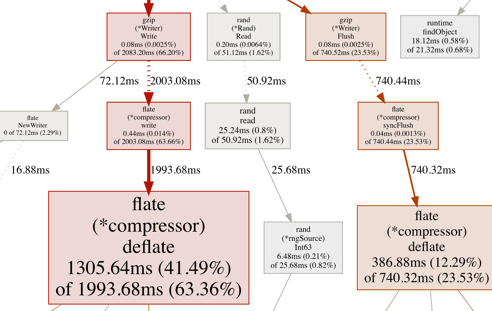
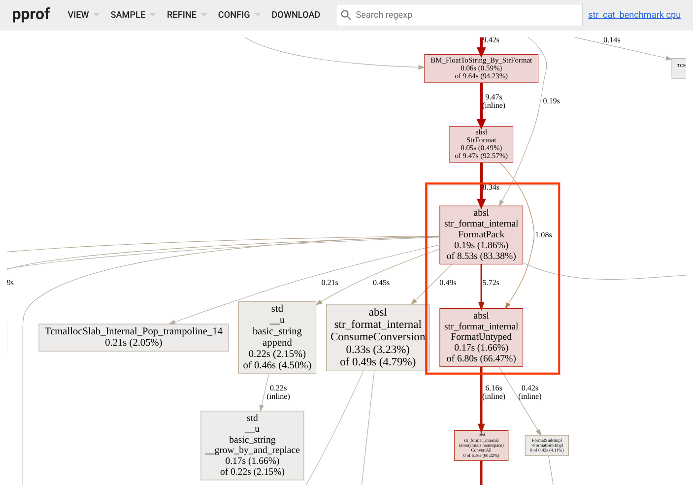
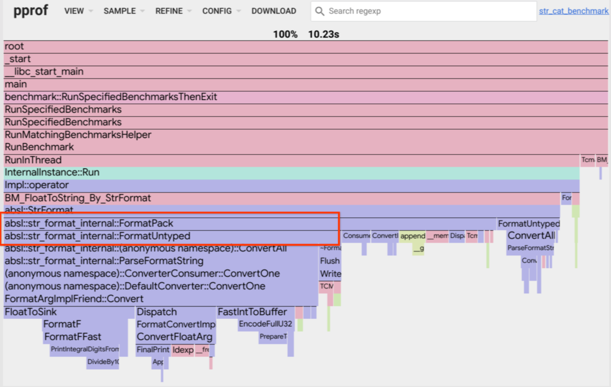
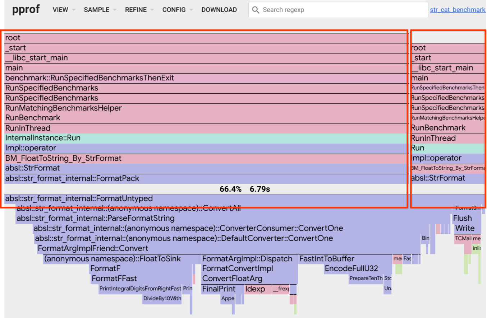
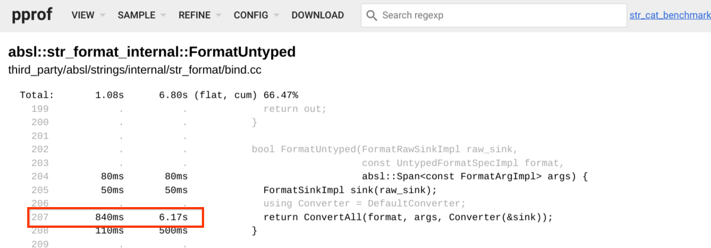
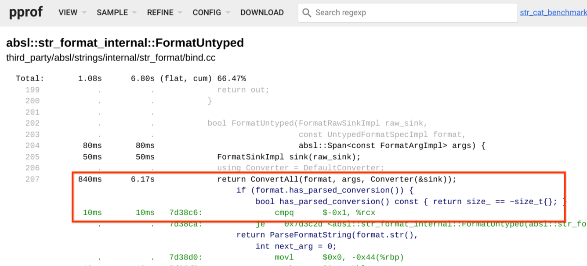

# [pprof](https://github.com/google/pprof/blob/main/doc/README.md)

pprof 是一个用于可视化和分析性能分析数据的工具。

pprof 读取 profile.proto 格式的性能分析样本集合，并生成报告以可视化和帮助分析数据。它可以生成文本报告和图形报告（通过使用 dot 可视化包）。

profile.proto 是一个 protocol buffer，用于描述一组调用栈和符号化信息。常见的用途是表示从统计性能分析中抽取的一组调用栈样本。该格式在 proto/profile.proto 文件中进行了描述。有关协议缓冲区的详细信息，请参阅 [https://developers.google.com/protocol-buffers](https://developers.google.com/protocol-buffers)。

性能分析数据可以从本地文件或通过 HTTP 读取。可以聚合或比较多个相同类型的性能分析数据。

如果性能分析样本包含机器地址，pprof 可以使用 binutils 原生工具（addr2line 和 nm）对其进行符号化。

## pprof 性能分析

pprof 处理 profile.proto 格式的数据。每个配置文件都是一系列样本的集合，每个样本都与位置层级结构中的一个点、一个或多个数值以及一组标签相关联。这些配置文件通常表示通过对程序进行统计抽样收集的数据，因此每个样本描述了一个程序调用堆栈以及在特定位置收集的样本数量或值。pprof 与配置文件的语义无关，因此可以用于其他用途。pprof 生成的报告的解释取决于配置文件来源定义的语义。

## 使用模式

`pprof` 有几种不同的使用方式。

### 报告生成

如果在命令行中指定报告格式：

```sh
pprof <格式> [选项] 源
```

pprof 将生成指定格式的报告并退出。格式可以是文本或图形。有关支持的格式、选项和源的详细信息，请参见下文。

### 交互式终端使用

不指定格式：

```sh
pprof [选项] 源
```

pprof 将启动一个交互式 shell，用户可以在其中输入命令。输入 `help` 获取在线帮助。

### Web 界面

如果在命令行中指定主机:端口：

```sh
pprof -http=[主机]:[端口] [选项] 源
```

pprof 将在指定的端口上开始处理 HTTP 请求。在浏览器中访问与端口对应的 HTTP URL（通常为 `http://<主机>:<端口>/`）即可查看界面。

## 详细信息

pprof 的目标是为配置文件生成报告。该报告基于位置层级结构生成，该层级结构由配置文件样本重建而成。每个位置包含两个值：

- `flat`：位置本身的值。
- `cum`：位置及其所有子位置的值之和。

对于多次包含同一位置的样本（例如，递归函数），每个位置仅计数一次。

### 选项

选项用于配置报告的内容。每个选项都有一个值，可以是布尔值、数值或字符串。虽然只能指定一种格式，但大多数选项可以彼此独立地选择。

一些常用的 pprof 选项包括：

- `-flat` [默认]、`-cum`：在文本报告中，分别根据条目的扁平值或累积值对其进行排序。
- `-functions` [默认]、`-filefunctions`、`-files`、`-lines`、`-addresses`：使用指定的粒度生成报告。
- `-noinlines`：将内联函数归类到其第一个行外调用者。例如，可以使用类似 `pprof -list foo -noinlines profile.pb.gz` 的命令生成带注释的源代码列表，并将内联函数中的指标归类到行外调用行。
- `-nodecount=int`：报告中的最大条目数。pprof 将仅打印指定数量的条目，并使用启发式方法选择要裁剪的条目。
- `-focus=regex`：仅包含报告条目与`regex`匹配的样本。
- `-ignore=regex`：不包含报告条目与`regex`匹配的样本。
- `-show_from=regex`：不显示第一个与`regex`匹配的条目之后的条目。
- `-show=regex`：仅显示与`regex`匹配的条目。
- `-hide=regex`：不显示与`regex`匹配的条目。

配置文件中的每个样本可能包含多个值，代表与该样本关联的不同实体。pprof 报告包含单个样本值，按照惯例，该值是报告中指定的最后一个值。`sample_index=` 选项用于选择要使用的值，可以设置为数字（从 0 到值的数量 - 1）或样本值的名称。

样本值是与单位关联的数值。如果 pprof 可以识别这些单位，它将尝试将这些值缩放到适合可视化的单位。`unit=` 选项将强制使用特定单位。例如，`unit=sec` 将强制所有时间值以秒为单位报告。pprof 可以识别大多数常用的时间和内存大小单位。

### 标签

配置文件中的样本可以带有标签。这些标签包含名称和值。值可以是数值或字符串；数值可以关联单位。标签用作额外的维度，用于对样本值进行分类。标签最常见的用途是根据标签值从配置文件中选择样本。pprof 也支持在可视化时使用标签。

### 标签过滤

`-tagfocus` 选项是基于标签值选择配置文件数据最常用的选项。它的语法为 `-tagfocus=regex` 或 `-tagfocus=range`：这将把数据限制为标签与正则表达式匹配或在范围内的样本。`-tagignore` 选项的语法相同，可用于过滤掉标签匹配的样本。如果同时指定了 `-tagignore` 和 `-tagfocus` 并且匹配到给定的样本，则该样本将被丢弃。

使用 `-tagfocus=regex` 和 `-tagignore=regex` 时，正则表达式将与每个标签关联的每个值进行比较。如果指定类似 `regex1,regex2` 的值，则只会保留标签值同时匹配 `regex1` 和 `regex2` 的样本。

除了能够按标签值进行筛选外，还可以使用 `-tagfocus=tagName=value` 的表示法指定特定值必须关联的标签名称。其中，`tagName` 必须与标签名称完全匹配，而 `value` 可以是正则表达式或范围。如果指定类似 `regex1,regex2` 的值，则标签值（与指定的标签名称配对）匹配 `regex1` 或 `regex2` 的样本将被匹配。

以下示例说明了如何使用 `-tagfocus`：

- `-tagfocus 128kb:512kb` 仅当样本包含内存值在指定范围内的任何数字标签时才接受该样本。
- `-tagfocus mytag=128kb:512kb` 仅当样本包含一个内存值在指定范围内的数值标签 `mytag` 时才接受该样本。目前无法指定 `-tagfocus mytag=128kb:512kb,16kb:32kb` 或 `-tagfocus mytag=128kb:512kb,mytag2=128kb:512kb`。数值标签只能指定单个值或范围。
- `-tagfocus someregex` 仅当样本包含一个 `tagName:tagValue` 字符串与指定正则表达式匹配的字符串标签时才接受该样本。未来，该选项将改为仅当样本包含一个 `tagValue` 字符串与指定正则表达式匹配的字符串标签时才接受该样本。
- `-tagfocus mytag=myvalue1,myvalue2` 仅当两个标签值中至少有一个存在时才匹配。

### 标签可视化

要列出配置文件中可用的标签及其值，请使用 `-tags` 选项。它将输出可用标签及其值，以及按每个标签值细分的样本值。

pprof 调用图报告（例如 `-web` 或 原始的`-dot`）会自动将所有标签的值可视化为图中的伪节点。使用 `-tagshow` 和 `-taghide` 选项可以限制显示的标签。这些选项接受一个正则表达式，该表达式与标签名称匹配，分别用于显示或隐藏标签。

`-tagroot` 和 `-tagleaf` 选项可用于为配置文件样本创建伪堆栈帧。例如，`-tagroot=mytag` 将在配置文件调用树的根节点添加堆栈帧，其中包含相应样本的标签值。类似地，`-tagleaf=mytag` 会将此类堆栈帧添加为每个样本的叶节点。当以树状格式（例如 `-http` 模式 Web UI 中的树状视图）可视化配置文件时，这些选项非常有用。

## 文本报告

pprof 文本报告以文本格式显示位置层次结构。

- `-text`：打印位置条目，每行一个，包括平面值和累计值。
- `-tree`：打印每个位置条目及其前驱和后继条目。
- `-peek=regex`：打印位置条目及其所有前驱和后继条目，不进行任何删减。
- `-traces`：打印每个样本及其位置，每行一个。

## 图形报告

pprof 可以生成 DOT 格式的图形报告，并使用 graphviz 包将其转换为多种格式。

这些报告将位置层次结构表示为一个图，报告条目表示为一个节点。使用启发式方法移除节点以限制图的大小，由 `nodecount` 选项控制。

- `-dot`：生成 .dot 格式的报告。所有其他格式均由此生成。
- `-svg`：生成 SVG 格式的报告。
- `-web`：在临时文件中生成 SVG 格式的报告，并启动 Web 浏览器查看。
- `-png、-jpg、-gif、-pdf`：生成这些格式的报告。

### 解读调用图

- 节点颜色：
    - 较大的正累计值为红色。
    - 较大的负累计值为绿色；负值最有可能出现在性能分析比较期间，详情请参阅此[部分](https://github.com/google/pprof/blob/main/doc/README.md#comparing-profiles)。
    - 接近于零的累计值为灰色。
- 节点字体大小：
    - 字体越大，表示绝对值越大。
    - 字体越小，表示绝对值越小。
- 边粗细：
    - 较粗的边表示该路径使用了更多资源。
    - 较细的边表示该路径使用了更少资源。
- 边颜色：
    - 较大的正值为红色。
    - 较大的负值为绿色。
    - 接近于零的值显示为灰色。
- 虚线边：两个连接位置之间的某些位置已被移除。
- 实线边：一个位置直接调用另一个位置。
- "(内联)"边标记：调用已内联到调用者中。

让我们考虑以下示例图：



- 对于节点：
    - `(*Rand).Read` 的平面值和累计值都很小，因为字体较小且节点为灰色。
    - `(*compressor).deflate` 的平面值和累计值都很大，因为字体较大且节点为红色。
    - `(*Writer).Flush` 的平面值很小，累计值很大，因为字体较小且节点为红色。
- 对于边：
    - `(*Writer).Write` 和 `(*compressor).write` 之间的边：
        - 由于它是虚线边，因此这两个节点之间移除了一些节点。
        - 由于它是粗线且为红色，因此这两个节点之间的调用栈使用了更多资源。
    - `(*Rand).Read` 和 `read` 之间的边：
        - 由于它是虚线边，因此这两个节点之间移除了一些节点。
        - 由于它是细线且为灰色，因此这两个节点之间的调用栈使用了较少资源。
    - `read` 和 `(*rngSource).Int63` 之间的边：
        - 由于这是一条实线边，因此这两个节点之间没有其他节点（即，这是一个直接调用）。
        - 由于这条边很细且呈灰色，因此这两个节点之间的调用栈资源占用较少。

## 带注释的代码

pprof 还可以生成带有示例的带注释源代码报告。要生成此类报告，源代码或二进制文件必须位于本地，并且配置文件必须包含具有适当详细程度的数据。

pprof 会在其当前工作目录及其所有父目录中查找源代码文件。pprof 会在环境变量 `$PPROF_BINARY_PATH` 指定的目录中查找二进制文件，默认情况下为 `$HOME/pprof/binaries`（Windows 系统上为 `%USERPROFILE%\pprof\binaries`）。它会按名称查找二进制文件，如果配置文件包含链接器构建 ID，它还会在以构建 ID 命名的目录中查找。

pprof 使用 binutils 工具来检查和反汇编二进制文件。默认情况下，它会在当前路径中查找这些工具，但也可以在环境变量 `$PPROF_TOOLS` 指向的目录中查找。

- `-list=regex`：生成与正则表达式匹配的函数的带注释源代码列表，每行源代码包含扁平值/累积值。
- `-disasm=regex`：生成与正则表达式匹配的函数的带注释反汇编列表。
- `-weblist=regex`：生成与正则表达式匹配的函数的源代码/汇编代码组合的带注释列表，并启动 Web 浏览器显示该列表。

## 比较性能分析

pprof 可以将一个性能分析结果与另一个性能分析结果相减，前提是这两个性能分析结果的类型兼容（例如，两个堆性能分析结果）。pprof 提供了两个选项，可用于指定要从源性能分析结果中减去的基准性能分析结果的文件名或 URL：

- `-diff_base=profile`：用于比较两个性能分析结果。输出中的百分比是相对于差异基准性能分析结果中的样本总数而言的。
- `-base=profile`：用于从同一程序稍后收集的另一个累积性能分析结果中减去一个累积性能分析结果（例如 [Go 阻塞分析](https://golang.org/doc/diagnostics.html#profiling)）。比较同一程序收集的累积性能分析结果时，输出中的百分比是相对于源性能分析结果总数与基准性能分析结果总数之差而言的。

当使用 `-diff_base` 或 `-base` 选项指定基准性能分析结果时，可以使用 `-normalize` 标志。此标志会缩放源性能分析结果，使源性能分析结果中的样本总数等于基准性能分析结果中的样本总数，然后再从源性能分析结果中减去基准性能分析结果。此功能可用于确定不同配置文件之间的相对差异，例如，哪个配置文件在特定函数中占用的 CPU 时间百分比更高。

使用 `-diff_base` 选项时，某些报告条目可能包含负值。如果合并后的配置文件以协议缓冲区的形式输出，则差异基准配置文件中的所有样本都将带有键为"pprof::base"且值为"true"的标签。如果随后使用 `pprof` 查看合并后的配置文件，其行为将如同分别传入了源配置文件和基准配置文件一样。

使用 `-base` 选项从稍后在同一程序上收集的另一个累积配置文件中减去一个累积配置文件时，百分比将相对于源配置文件和基准配置文件的总数之差，并且所有值均为正数。通常情况下，某些报告条目可能包含负值，并且百分比将相对于按地址级别聚合的所有样本绝对值的总和。

## 获取性能分析

pprof 可以从文件中读取性能分析文件，也可以直接通过 HTTP 或 HTTPS 从 URL 读取。其原生格式是经过 gzip 压缩的 profile.proto 文件，但也支持一些由 [gperftools](https://github.com/gperftools/gperftools) 生成的旧格式。

从 URL 处理程序获取性能分析文件时，pprof 接受一些选项来指定等待时间。

- `-seconds=int`：pprof 请求获取指定持续时间（以秒为单位）的性能分析文件。此选项仅适用于基于运行时间的性能分析文件，例如 CPU 性能分析文件。
- `-timeout=int`：pprof 通过 HTTP 获取性能分析文件时，等待指定的超时时间。如果未指定超时时间，pprof 将使用启发式方法来确定合理的超时时间。

pprof 还接受一些选项，允许用户指定在从受保护的端点获取或符号化性能分析文件时要使用的 TLS 证书。有关生成这些证书的更多信息，请参阅 [https://docs.docker.com/engine/security/https/](https://docs.docker.com/engine/security/https/)。

- `-tls_cert= /path/to/cert`：包含用于获取和符号化配置文件的 TLS 客户端证书的文件。
- `-tls_key= /path/to/key`：包含用于获取和符号化配置文件的 TLS 私钥的文件。
- `-tls_ca= /path/to/ca`：包含用于获取和符号化配置文件的证书颁发机构的文件。

pprof 还支持在收集或符号化配置文件时跳过对服务器证书链和主机名的验证。要跳过此验证，请在 URL 中使用"https+insecure"代替"https"。

如果指定了多个配置文件，pprof 将获取所有配置文件并将它们合并。这对于合并来自分布式作业的多个进程的配置文件非常有用。这些配置文件可以来自不同的程序，但必须兼容（例如，CPU 配置文件不能与堆配置文件合并）。

## 符号化

pprof 可以将符号信息添加到仅包含地址信息的配置文件中。这对于编译型语言的配置文件非常有用，因为配置文件源可能难以甚至无法包含函数名或源坐标。

pprof 可以使用 binutils 工具检查二进制文件来本地提取符号信息，也可以请求提供符号化接口的运行作业。

pprof 默认会尝试对配置文件进行符号化，其 `-symbolize` 选项提供了一些符号化控制：

- `-symbolize=none`：禁用 pprof 的所有符号化操作。
- `-symbolize=local`：仅尝试使用 binutils 工具从本地二进制文件中对配置文件进行符号化。
- `-symbolize=remote`：仅尝试通过联系运行作业的符号化处理程序来对运行作业进行符号化。

对于本地符号化，pprof 会先在配置文件指定的路径中查找二进制文件，然后再在环境变量 `$PPROF_BINARY_PATH` 指定的路径中查找。此外，可以将主二进制文件的名称作为第一个参数直接传递给 pprof，以覆盖配置文件的主二进制文件的名称或位置，例如：

```sh
pprof /path/to/binary profile.pb.gz
```

默认情况下，pprof 会尝试对 C++ 符号进行反混淆和简化，以便为 C++ 符号提供易读的名称。它会强制丢弃模板参数和函数参数。可以使用 `-symbolize=demangle` 选项来控制此行为。请注意，对于远程符号化，符号化处理程序可能不会提供混淆后的名称。

- `-symbolize=demangle=none`：不执行任何反混淆操作。如果可用，则显示混淆后的名称。
- `-symbolize=demangle=full`：进行反混淆操作，但不执行任何简化操作。如果可用，则显示完整的反混淆后的名称。
- `-symbolize=demangle=templates`：进行反混淆操作并修剪函数参数，但不修剪模板参数。

## Web界面

当用户请求Web界面时（通过在命令行中提供`-http=[host]:[port]`参数），pprof会启动一个Web服务器并打开一个指向该服务器的浏览器窗口。服务器提供的Web界面允许用户以多种格式交互式地查看配置文件数据。

### 视图

显示顶部是一个包含一些按钮和菜单的标题栏。`View`菜单允许用户在不同的配置文件可视化方式之间切换。可用视图如下：

### 图表

本地Web界面中的默认视图显示一个图表，其中节点代表函数，边表示调用者/被调用者关系。

注意：您可以按住鼠标按钮拖动显示区域，也可以使用鼠标滚轮或捏合/展开触摸手势进行缩放。



例如，`FormatPack` 有一条指向 `FormatUntyped` 的出边，表明前者调用了后者。边上的数字（5.72 秒）表示从 `FormatPack` 调用时，`FormatUntyped`（及其被调用方）所花费的时间。

更多详情请参见[前面的说明](https://github.com/google/pprof/blob/main/doc/README.md#interpreting-the-callgraph)。

### 火焰图

切换到`Flame graph`视图（通过`View`菜单）将显示[火焰图](https://www.brendangregg.com/flamegraphs.html)。此视图以简洁的方式表示调用方/被调用方关系：



此视图中的方框对应于性能分析中的堆栈帧。调用方框位于被调用方框的正上方。每个方框的宽度与其在调用堆栈中出现的帧对应的性能分析样本值之和成正比。特定方框的子元素按大小从左到右递减的顺序排列。

例如，这里我们看到 `FormatPack` 位于 `FormatUntyped` 的正上方，这表明前者调用了后者。`FormatUntyped` 的宽度对应于此次调用所占的时间比例。

不同方框中显示的名称可能具有不同的字体大小。这些大小差异是为了尽可能多地将名称内容放入方框中；不应对此大小做出其他解释。

方框的颜色根据相应函数所在的包的名称而定。例如，在 C++ 性能分析中，所有对应于 `std::` 函数的帧都将被分配相同的颜色。

### 查看调用者

传统的火焰图提供自顶向下的视图：很容易看到某个函数调用的其他函数，但很难找到特定函数的调用者。例如，在链接的示例中，由于 `FormatUntyped` 有多个调用者，因此出现了多个实例。

Pprof 的火焰图扩展了传统模型：当选择一个函数时，图表会发生变化，显示调用该函数的调用堆栈。因此，单击任何 `FormatUntyped` 框将显示最终调用 `FormatUntyped` 的调用堆栈：



### 差异模式

使用 `--diff_base` 选项时，方框的宽度与以 `box` 为根的子树中成本增加和减少的总和成正比。例如，如果 `box` 的一个子节点的成本减少了 150，而另一个子节点的成本增加了 200，则方框的宽度将与 150 + 200 成正比。净增加或减少值（前面的示例净增加值为 200 - 150，即 50）用阴影区域表示。阴影区域的大小与净增加或净减少值成正比。净增加时阴影为红色，净减少时阴影为绿色。

### 内联

内联通过调用者和被调用者之间没有水平边界来表示。例如，假设 X 调用 Y，Y 再调用 Z，并且 Y 对 Z 的调用被内联到 Y 中。X 和 Y 之间会有黑色边框，但 Y 和 Z 之间没有边框。

## 带注释的源代码

让我们通过查看带有性能数据注释的源代码来深入了解 `FormatUntyped` 函数内部的运行机制。首先，右键单击该函数的文本框以打开上下文菜单。


选择`Show source in new tab`。这将创建一个新标签页，显示该函数的源代码。

注意：您也可以通过从`View`菜单中选择`Source`来显示源代码，但仅当您专注于一个或几个例程时才建议这样做，因为查看多个函数时，源代码的显示速度可能会非常慢且内容非常多。



每行源代码都标注了执行该行代码所花费的时间。这里有两个数字（例如，截图中第 207 行的 840 毫秒和 6.17 秒）。第一个数字不包括从该行调用的函数所花费的时间，第二个数字则包含了这些时间。

让我们点击第 207 行，进一步查看。这将展开显示，包括内联函数调用的源代码以及相应的汇编代码。



汇编代码以绿色显示。内联函数的源代码以蓝色显示，并按其内联级别缩进。例如，缩进表明第 207 行的 `ConvertAll` 调用是内联的，而它本身又内联了对 `has_parsed_conversion` 的调用，后者最终展开为 `cmpq` 指令。

## 反汇编

有时，按指令顺序查看反汇编代码而不与源代码交错显示会很有帮助。您可以从`View`菜单中选择`Disassemble`来实现这一点。

注意：除非您只关注一个或几个例程，否则请勿选择`Disassemble`，因为查看多个函数时，反汇编过程可能会非常缓慢且输出大量数据。


## 常用功能

有时，您可能会发现一个表格很有帮助，该表格仅显示个人资料中最常用的功能。


表格显示了两个不同指标的数值（和百分比）：

- `flat`：此函数中的轮廓样本
- `cum`：此函数及其被调用者中的（累计）轮廓样本

表格初始按 `flat` 降序排列。点击 `Cum` 表头，表格将按函数及其被调用者中的样本降序排列。

## 预览

此视图以简单的文本格式显示每个函数的调用者/被调用者。火焰图视图通常更有帮助。

## 配置

`Config`菜单允许用户将当前优化设置（例如，焦点和隐藏列表）保存为命名配置。保存的配置可以稍后重新应用以恢复已保存的优化设置。`Config`菜单包含：

`Save as ...`：显示一个对话框，用户可以在其中输入配置名称。当前优化设置将以指定的名称保存。

`Default`：通过移除所有优化设置切换回默认视图。

`Config`菜单还包含每个命名配置的条目。选择此类条目将应用该配置。当前选中的条目会显示 `✓`。点击此类条目右侧的 `🗙` 可删除配置（在提示用户确认后）。

## 待办事项：涵盖以下问题：

- 整体布局
- 其他菜单项